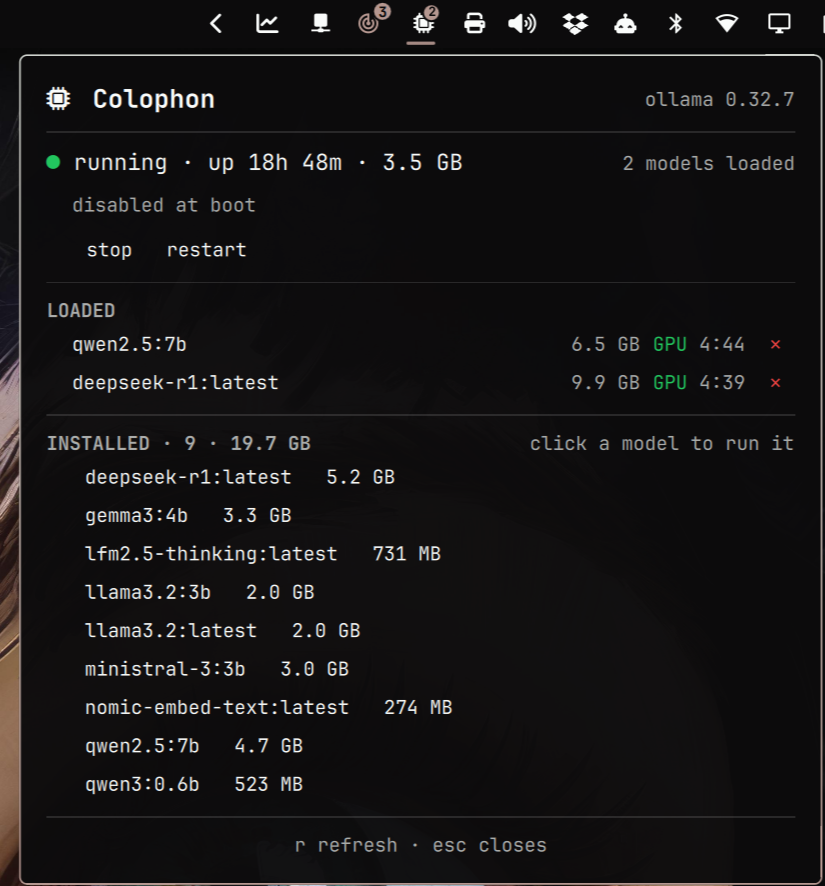

# Colophon

Colophon is an Omarchy shell bar widget that shows the state of your local
Ollama server — running, stopped, or something in between — and lets you
start it, stop it, restart it, and load or unload models, without leaving
the bar.

The problem it solves: Ollama is a 19 GB service made of a handful of large
model files, and you generally want it running only while you're actually
using a model. Today, without Colophon, "use a local model" means opening a
terminal, remembering the unit name, authenticating, waiting for the port to
bind, and warming the model from a second command. Colophon makes that one
click, and makes "is it on, and what is it holding right now?" answerable at
a glance.

<!-- TODO: capture a screenshot of the panel open in the running state and
     add it here, e.g. . It should show one model
     warmed and loaded, its GPU badge and keep-alive countdown visible, and
     the full installed list scrolling underneath so the panel stays useful
     even when nothing is loaded. -->

Open the panel while the server is running and you'll see a header reading
"Colophon" next to the server version, a status line such as "running · up
14m · 4.1 GB" with stop and restart buttons and a "disabled at boot" note, a
LOADED section showing each warmed model with its GPU badge and an
expiry countdown next to an unload button, and an INSTALLED section below it
listing the rest of the model store with a byte total, scrolling within a
capped height so the panel never outgrows the screen. The bar glyph itself
carries a badge for the count of loaded models; its color stays the default
foreground as long as nothing is wrong.

## Prerequisites

**Runtime — required:**

| Program | Used for | Arch package |
|---|---|---|
| `ollama` | The server itself, and `ollama --version` as the client-version fallback when it's down | `ollama` |
| `systemctl` | Reading and controlling `ollama.service` | `systemd` |
| `python3` | The collector and action scripts | `python` |
| `notify-send` | The "service died unexpectedly" notification | `libnotify` |

Also required: the Omarchy shell itself, which you already have if you're
reading this bar. There are no pip or npm dependencies at runtime — the
Python side is stdlib-only by design (see `AGENTS.md` if you're extending
it).

Install anything missing with `omarchy pkg add <package>`.

Colophon does **not** verify any of this at startup. A missing tool surfaces
as a collector error in the panel (see Troubleshooting below), not as a
friendly "please install X" message. An automated preflight check that maps
a missing binary to its package is deliberately deferred — see Known
Limitations.

## Install

```bash
omarchy plugin add https://github.com/ssandys/colophon.git --enable
```

That clones the plugin into `~/.config/omarchy/plugins/ssandys.colophon/`.
`--enable` does more than flip a flag: it runs through the shell's own
plugin-enable path, which places a not-yet-positioned bar widget into its
manifest's default section — `right`, for Colophon — the moment it's
enabled. If you run the command from an interactive terminal you'll be
asked which section to use first; either way, by the time the command
returns the widget is already somewhere on your bar. Nothing further is
needed if `right` (or whatever you picked) is where you want it.

To move it afterward, e.g. to the left section:

```bash
omarchy bar move ssandys.colophon --section left
```

(`move` repositions a widget already in the bar layout; `put` only adds one
that isn't there yet, so running `put` at this point would be a no-op.)

**Grant it privilege.** Start/stop/restart go through `systemctl` against a
*system* unit, which needs authentication. `pkexec` isn't an option here:
the widget spawns its helper scripts as a headless `Process` with no
controlling terminal, and the reference machine this was built against runs
no polkit agent for a prompt to appear in either way. Colophon installs a
narrow polkit rule instead, so no interactive authentication is ever
needed:

```bash
sudo bin/install-privileges
```

This grants exactly one thing: **your user account may start, stop, and
restart `ollama.service` without a password, and nothing else** — not
`enable`/`disable` (see Boot start, below), not any other unit, and not any
other verb on this one: `freeze`, `kill`, and `set-property` on
`ollama.service` still require a password.

Where you run it from depends on how you installed:

- **Published clone:** `sudo ~/.config/omarchy/plugins/ssandys.colophon/bin/install-privileges`
- **Dev checkout** (working on Colophon itself): `sudo bin/install-privileges`, from the repo root.

`bin/` ships inside a published `omarchy plugin add` clone (it's an
ordinary `git clone`) but is deliberately excluded from the dev-install copy
(`bin/install`'s rsync), so the script only ever exists in one of those two
places at a time — never under
`~/.config/omarchy/plugins/ssandys.colophon-dev/`.

Check the grant:

```bash
bin/install-privileges --check
```

No root needed. It doesn't use `pkcheck` — polkit refuses to accept
`--detail` arguments (`unit`, `verb`) from an unprivileged caller, and a
detail-less query can't match a rule scoped by both, so it would only ever
report the action's bare, unhelpful default. Instead, `--check` exercises
the grant for real, using whichever verb is a safe no-op for the unit's
current state (`stop` if it's already inactive, `start` if it's already
active), and reports whether polkit actually let it through.

Remove it:

```bash
sudo bin/install-privileges --remove
```

## Reading the bar

| Status | Glyph color | Badge |
|---|---|---|
| running | default bar foreground | loaded-model count, when > 0 |
| stopped | dimmed | none |
| starting / stopping | amber | none |
| foreign (see Troubleshooting) | amber | loaded-model count, when > 0 |
| failed / missing | red | none |

The badge color deliberately never changes: severity reaches the bar
entirely through the glyph's color, so a red glyph carrying a badge means
"models loaded, *and* something is wrong."

Hovering the icon shows a tooltip summary, e.g. `ollama 0.32.7 · up 14m ·
llama3.2:3b loaded (GPU)` while running, or `ollama 0.32.7 stopped · 9
models, 19 GB` while not.

## Using the panel

- **Click an installed model** to warm it — this starts the server first if
  it isn't already up, waits for it to answer, then loads the model.
  Starting the server and binding the port takes up to ~20 seconds; loading
  the model itself can take considerably longer for a large model on a cold
  page cache, and Colophon waits for that too rather than reporting a false
  timeout while the load is still quietly succeeding. The row reads
  "warming…" and the status line reads "starting…" for as long as either
  step takes.
- **`✕`** next to a loaded model unloads it immediately, freeing its memory.
- **`r`** refreshes the panel right away.
- **`esc`** closes the panel.
- **Middle-click** the bar icon starts Ollama if it isn't already running
  (i.e. it's `stopped` or `failed`) and just refreshes the snapshot
  otherwise. This is deliberately asymmetric: starting is harmless, but
  stopping on a stray middle-click could kill a generation in progress.

## Boot start

Ollama's unit ships `disabled`, matching the on-demand design: the server
shouldn't come up automatically at boot. Colophon reports this state (look
for "disabled at boot" / "enabled at boot" under the status line) but
cannot change it from the panel. If you want it to start at boot anyway,
this is a one-time command:

```bash
sudo systemctl enable ollama.service
```

**Why the widget can't do this itself:** enable/disable go through a
different polkit action, `org.freedesktop.systemd1.manage-unit-files`, and
systemd invokes it with **no `unit` detail at all** — a polkit rule has
nothing to scope it by. Granting that action would grant password-free
enable/disable of *every* unit on the system, not just this one. That's a
materially bigger, and materially riskier, grant than the three-verb,
one-unit rule above, so the boot toggle was left out of Colophon rather than
widening what it asks for.

## Configuration

Set these from the shell's widget settings panel for `ssandys.colophon`, or
directly in `shell.json`. Defaults and ranges below come straight from
`manifest.json`.

| Key | Type | Default | Range | Effect |
|---|---|---|---|---|
| `pollIntervalOpenSec` | integer | 2 | 1–30 | Poll cadence (seconds) while the panel is open. |
| `pollIntervalRunningSec` | integer | 10 | 5–120 | Poll cadence while the panel is closed and the server is up. Also used during the brief `starting`/`stopping` transients — they resolve on their own, and a fourth interval key isn't worth having just for them. |
| `pollIntervalIdleSec` | integer | 30 | 5–300 | Poll cadence while the panel is closed and the server is down (`stopped`, `failed`, or `missing`). |
| `keepAliveMinutes` | integer | 5 | 1–120 | How long a model stays warm after loading, sent as `keep_alive` on every warm. |
| `apiBase` | string | `http://127.0.0.1:11434` | — | Where Colophon probes for the Ollama API. |
| `showInstalledModels` | boolean | true | — | Show the installed-model list in the panel. |
| `notifyServiceDied` | boolean | true | — | Desktop notification when the service dies unexpectedly. |

**`apiBase` must be kept in sync with a custom `OLLAMA_HOST`.** The
collector only ever probes `apiBase`; if you've pointed Ollama at a
different host or port via `OLLAMA_HOST` and don't tell Colophon the same
thing, Colophon has no way to discover the real server on its own — but
which wrong status you see depends on *how* `OLLAMA_HOST` was set. Set it
via a systemd override on the unit (`sudo systemctl edit ollama.service`,
the method Ollama's own docs recommend for persisting it), and
`ollama.service` stays genuinely `active`: the status resolves to
`starting`, relabeling itself after 15 seconds to "started, but not
answering on :11434" — it never reads `stopped`. Set it any other way,
with the unit itself never started, and it reads `stopped` instead, because
systemd genuinely has nothing running to report.

## Troubleshooting

**"permission denied" when you click start, stop, or restart.** The polkit
grant is missing, or was installed for a different user than the one
running the shell. Run `sudo bin/install-privileges` (see Install, above),
then confirm with `bin/install-privileges --check`.

**The widget looks stale or wrong after an update.** Quickshell doesn't
re-create an already-running widget when the plugin's *structure* changes,
so a new property or binding won't show up until the shell restarts:

```bash
omarchy restart shell
```

(This restarts your whole shell, not just Colophon — expect a brief flicker
across the whole bar and any open panels.)

**A server you started by hand shows up as "running — not managed by
systemd."** That's the `foreign` status: Colophon found something
answering on `apiBase` that systemd doesn't know about — a hand-run `ollama
serve`, or anything else bound to the same port. Stop and Restart are
disabled in this state on purpose: systemd genuinely cannot stop a process
it isn't tracking, so the widget doesn't offer to.

**A server you know is running still reads as `stopped`, or gets stuck on
`starting`.** Check that `apiBase` (above) actually matches wherever
`OLLAMA_HOST` points — Colophon probes exactly one address, and anything
else is invisible to it. Which of the two you see depends on how
`OLLAMA_HOST` was set: a systemd override keeps `ollama.service` itself
`active`, so the status reads `starting` (relabeling after 15s to "started,
but not answering on :11434") and never `stopped`; any other method, with
the unit itself never started, reads as `stopped` instead.

**Per-row model sizes add up to more than the total shown.** Expected, not
a bug. Models on disk share blobs (layers) — a base weight file reused
across two tags, say — and each row's size sums that model's *own* layers,
while the total (`INSTALLED · N · size`) sums each blob digest exactly
once. Two models sharing a layer will each report its full size while the
total counts it once.

**Colophon's byte totals don't match `du -sh /var/lib/ollama`.** Not a bug
— different unit systems. Colophon formats sizes in SI units (base 1000:
KB, MB, GB), the same convention `ollama list` and `ollama ps` themselves
use; `du`, `df`, and most file managers default to binary units (base
1024), often still labeled "KB"/"MB"/"GB" regardless. The same byte count
legitimately prints two different numbers depending which tool reports it.

**Something looks wrong and you want to see the raw data.** Run the
collector directly — it's a standalone script, no widget required:

```bash
python3 ~/.config/omarchy/plugins/ssandys.colophon/scripts/colophon_collect.py
```

(or `scripts/colophon_collect.py` from a dev checkout). This prints the
exact JSON snapshot the panel is working from — unit state, API
reachability, loaded and installed models, and on error, the full message
the panel would otherwise truncate. Pipe it through `jq .` for something
readable.

## Known limitations

- One local Ollama instance only; remote or multiple `OLLAMA_HOST` targets
  are out of scope.
- Boot state is reported, not settable, from the widget — see Boot start,
  above.
- `foreign` cannot distinguish a hand-run `ollama serve` from any other
  process bound to the same port. It reports "not managed by systemd,"
  which is true either way.
- Per-model sizes sum that model's own layers while the total sums unique
  blob digests, so the rows can add up to more than the total (see
  Troubleshooting).
- Warming routes on a `model_family` lookup; an exotic family Colophon
  doesn't recognize falls through to `/api/generate` and surfaces Ollama's
  own error rather than guessing again.
- No preflight dependency check. A missing binary surfaces as an ordinary
  collector error, not a "please install X" message — see Prerequisites.

## Uninstall

```bash
sudo bin/install-privileges --remove
omarchy plugin remove ssandys.colophon
```

Remove the polkit rule *first*. `bin/install-privileges` lives inside the
plugin directory that `omarchy plugin remove` deletes, so removing the
grant afterward would leave you with no script to run it from without
cloning the repo again. Uninstalling the widget never touches
`ollama.service` or anything under `/var/lib/ollama` either way — your
server and your models are untouched.
